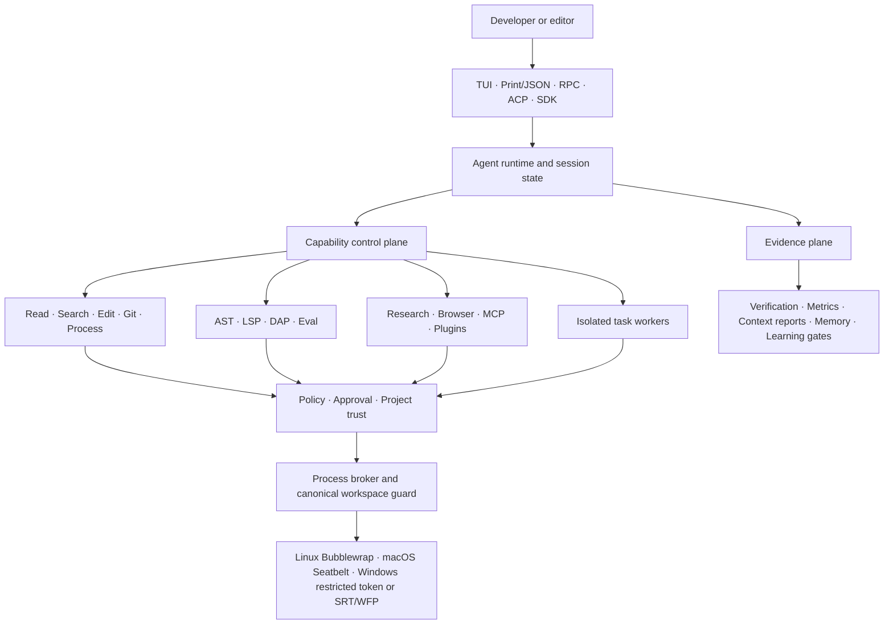

<p align="center">
  <a href="https://github.com/d3f4w2/pi-Gogogo">
    
  </a>
</p>

<h1 align="center">Pi GoGoGo</h1>

<p align="center">
  <strong>A governed, extensible coding-agent platform for serious local engineering.</strong>
</p>

<p align="center">
  Think locally. Execute within boundaries. Prove every change.
</p>

<p align="center">
  <a href="https://github.com/d3f4w2/pi-Gogogo/actions/workflows/ci.yml"></a>
  <a href="LICENSE"></a>
  
  
  
</p>

<p align="center">
  <a href="#quick-start">Quick start</a> ·
  <a href="#capability-platform">Capabilities</a> ·
  <a href="#security-model">Security</a> ·
  <a href="#measured-evidence">Evidence</a> ·
  <a href="packages/coding-agent/docs/engineering-portfolio.zh-CN.md">中文工程档案</a>
</p>

---

Pi GoGoGo takes the small, composable [Pi](https://github.com/earendil-works/pi) agent harness and develops it into a capability platform: one local agent runtime with bounded execution, code intelligence, isolated task workers, external research, protocol adapters, evidence-driven validation, and reversible context management.

It is deliberately not a pile of disconnected tools. Every capability is routed through shared workspace boundaries, approval rules, lifecycle controls, and observable failure behavior.

> This repository is a source-development fork. The package namespace remains `@earendil-works/*`; run this repository from source to use the exact capabilities documented here.

<p align="center">
  
</p>

## Why this fork exists

| Principle | Concrete behavior |
| --- | --- |
| **Safe by default** | Model-controlled built-in tools start behind a lightweight OS sandbox instead of inheriting unrestricted host execution. |
| **One capability plane** | Text search, AST, LSP, DAP, Git, browser, MCP, ACP, evaluation, and memory share one runtime and one policy model. |
| **Evidence over confidence** | Hidden acceptance checks, regression capture, deterministic reports, and benchmark artifacts make results inspectable. |
| **Bounded autonomy** | Isolated workers have role limits, hard timeouts, output caps, temporary snapshots, and no automatic merge. |
| **Fast when unused** | Heavy capabilities are discovered and loaded lazily; optional failures do not block the main session. |
| **Simple for the user** | Strong defaults require little configuration, while advanced controls remain explicit and reversible. |

## Architecture



The host runtime coordinates state and trusted extensions. Model-controlled built-in file and process operations cross the policy and broker boundary before reaching the operating system. Evidence is recorded separately from execution so the agent cannot silently redefine its own acceptance criteria.

## Quick start

### Requirements

- Node.js `>=22.19.0`
- Git
- A supported provider login or API key

### Run the current fork from source

```bash
git clone https://github.com/d3f4w2/pi-Gogogo.git
cd pi-Gogogo
npm install --ignore-scripts
```

macOS or Linux:

```bash
./pi-test.sh
```

Windows PowerShell:

```powershell
.\pi-test.ps1
```

Inside Pi, run `/login`, choose a provider, and start with a real task:

```text
Map the authentication flow, identify its trust boundaries, and show me the evidence before changing code.
```

### Stronger Windows isolation

The zero-setup Windows backend restricts writes and process trees. For a dedicated low-privilege user plus Windows Filtering Platform network isolation, run the pinned installer once from a trusted terminal:

```powershell
npx --yes @anthropic-ai/sandbox-runtime@0.0.71 windows-install
```

Pi detects the backend automatically. `/doctor` shows the active sandbox and its behavioral health checks.

## Capability platform

### Governed execution

- Default `auto`, `read-only`, and explicit `full-access` sandbox modes.
- Canonical path enforcement across `read`, `write`, `edit`, `grep`, `find`, `ls`, and shell execution.
- Protected control paths, credential locations, `.git`, `.pi`, and `.env*` write boundaries.
- Fail-closed startup when a selected sandbox backend is unhealthy.
- Exact `host:port` network authorization with command, session, or workspace scope where the OS backend supports it.

[Security model](packages/coding-agent/docs/security.md) · [Sandbox ADR](packages/coding-agent/docs/adr/0033-default-lightweight-os-sandbox.md) · [Container patterns](packages/coding-agent/docs/containerization.md)

### Local code intelligence

- Structural search and transactional edits across JavaScript, TypeScript, TSX, HTML, CSS, Python, Go, Rust, JSON, YAML, and bounded Markdown structures.
- Project-local LSP broker shared across sessions, with reference counting, negative caching, crash recovery, and private-process fallback.
- DAP-backed debugging, workspace-scoped Git workflows, persistent process management, and verification tools.
- Python and Bun evaluation cells with a fixed read-only host-tool bridge, call budgets, output caps, and shared cancellation.

[Code intelligence architecture](packages/coding-agent/docs/local-code-intelligence-plane.md) · [LSP](packages/coding-agent/docs/lsp.md) · [DAP](packages/coding-agent/docs/dap-architecture.md)

### Isolated task workers

`task` delegates bounded research or coding work to independent agents in temporary project snapshots. Up to three tasks can run concurrently; each has a hard timeout, role-specific tool policy, bounded result size, and no recursive task spawning. Worker changes never merge automatically.

[Task worker guide](packages/coding-agent/docs/task-workers.md) · [Isolation decision](packages/coding-agent/docs/adr/0044-bounded-isolated-task-workers.md)

### External information and Browser 2.0

- Official-source routing for GitHub, GitLab, npm, PyPI, crates.io, Go modules, arXiv, OSV, NVD, CISA KEV, and documentation sites.
- Read-only resource addresses such as `github://`, `npm://`, `pypi://`, `arxiv://`, and `osv://` through the normal `read` and `grep` tools.
- Credential-free bounded caching, in-flight request coalescing, SSRF protection, and explicit untrusted-content metadata.
- Isolated browser profiles, multiple tabs, semantic snapshots, stale-reference rejection, workspace-only uploads/downloads, and bounded diagnostics.

[External information plane](packages/coding-agent/docs/external-information-plane.md) · [Hardening proof](packages/coding-agent/docs/experiments/2026-08-10-external-information-plane-hardening-proof.md)

### MCP, ACP, and controlled plugins

- MCP over stdio, Streamable HTTP, and SSE, with lazy discovery, project-trust gating, OAuth PKCE, credential-bound storage, and unified approval.
- ACP editor integration over NDJSON with capability negotiation, session reuse, cancellation, terminal/file routing, and no silent local retry after client-side failure.
- Manifested plugins with compatibility checks, content digests, explicit approval, atomic update, rollback, and lifecycle-script review.

[MCP](packages/coding-agent/docs/mcp.md) · [ACP](packages/coding-agent/docs/acp.md) · [Plugins](packages/coding-agent/docs/plugins.md)

### Context, memory, and controlled learning

- Append-only context checkpoints with deterministic preview reports, compare-and-swap guards, rewind, and full-view restore.
- Evidence-scoped memory that treats current repository facts as stronger than historical recall.
- Learning candidates gated by explicit evaluation and regression evidence instead of self-reported success.
- Prompt-cache state uses content digests rather than retaining raw prompt bodies.

[Context lifecycle](packages/coding-agent/docs/context-lifecycle.md) · [Memory](packages/coding-agent/docs/memory.md) · [Self-evolution](packages/coding-agent/docs/self-evolution.md) · [Prompt cache](packages/coding-agent/docs/prompt-cache-architecture.md)

## Measured evidence

Recorded on deterministic local fixtures on 2026-08-10. These numbers describe the checked-in benchmark scenarios, not universal production SLAs.

| Area | Recorded result |
| --- | ---: |
| Context lifecycle | `48,910 → 7,850` estimated input tokens, **84.0% reduction**, with `98/98` deterministic evidence records retained |
| Shared LSP | `244.031 ms → 2.948 ms` from cold start to second-session availability, **98.79% lower** |
| External research | Official source selected first in `10/10` fixed cases, with `1.0` mean model-visible tool call |
| External input | `132.2` versus `428` estimated tokens on the fixed fixture, **69.11% reduction** |
| Resource cache | `90%` hit rate across ten repeated reads; one source fetch |
| Changed-surface verification | **65 test files / 608 passing tests** across focused package and script groups |

Raw and narrative evidence lives in [`docs/benchmarks`](packages/coding-agent/docs/benchmarks), the [external hardening proof](packages/coding-agent/docs/experiments/2026-08-10-external-information-plane-hardening-proof.md), and the [Chinese engineering portfolio](packages/coding-agent/docs/engineering-portfolio.zh-CN.md).

## Security model

Pi GoGoGo separates several concepts that are often incorrectly collapsed into one “permission system”:

1. **Project trust** decides whether project-local settings, packages, skills, prompts, and extensions may load.
2. **Tool approval** decides whether a requested operation is allowed at the interaction layer.
3. **Workspace policy** constrains canonical paths, protected locations, and operation type.
4. **Process brokering** routes built-in process execution through one controlled boundary.
5. **OS enforcement** applies the platform sandbox and, where supported, network isolation.

These layers are complementary. Project trust is not a sandbox, and a UI approval prompt is not an operating-system boundary.

> **Trusted extension boundary:** TypeScript extensions run inside the host process and may call Node.js APIs directly. They can bypass built-in tool brokering. Review extension and plugin source before enabling it; use a container, VM, or micro-VM for hostile repositories or unattended workloads.

Read the complete [security model](packages/coding-agent/docs/security.md) before using the agent on sensitive systems.

## Interfaces and protocols

| Interface | Use case |
| --- | --- |
| Interactive TUI | Human-in-the-loop local development with streaming tools, approvals, sessions, and rich terminal UI |
| Print / JSON | One-shot prompts and machine-readable automation |
| RPC | Process integration over the native Pi protocol |
| ACP | Editor-hosted agent sessions with negotiated filesystem and terminal capabilities |
| SDK | Embed the same runtime in a TypeScript application |
| MCP client | Attach external tools, resources, and prompts without creating a second agent runtime |

The same session and capability core serves every interface; adapters do not get a separate policy bypass.

## Monorepo map

| Package | Responsibility |
| --- | --- |
| [`pi-coding-agent`](packages/coding-agent) | CLI, TUI mode, tools, sandbox, extensions, protocol adapters, and capability platform |
| [`pi-agent-core`](packages/agent) | Provider-neutral agent loop, tool calls, state, steering, and session lifecycle |
| [`pi-ai`](packages/ai) | Unified multi-provider LLM API, model discovery, transport, and prompt-cache state |
| [`pi-tui`](packages/tui) | Differential terminal rendering and interactive components |
| [`pi-protocol`](packages/protocol) | Transport-neutral framed CBOR protocol |
| [`pi-client`](packages/client) / [`pi-server`](packages/server) | Remote session client and experimental server runtime |
| [`pi-telemetry`](packages/telemetry) | Vendor-neutral telemetry contracts and typed schemas |
| [`pi-evals`](packages/evals) | Evaluation harnesses, artifacts, and command fixtures |
| [`pi-session-backends`](packages/session-backends) | Pluggable persistent session storage |

## Development

```bash
npm install --ignore-scripts  # Install without dependency lifecycle scripts
npm run check                 # Format, lint, dependency policy, types, smoke checks
./test.sh                     # Non-LLM test suites
./pi-test.sh                  # Run the coding agent directly from source
```

Windows equivalents:

```powershell
.\pi-test.ps1
```

Dependency and release metadata are treated as reviewed code: external dependencies are exact-pinned, lockfile changes are guarded, published CLI dependencies receive a generated shrinkwrap, and CI installs with lifecycle scripts disabled. See [Supply-chain hardening](packages/coding-agent/docs/security.md) and [CONTRIBUTING.md](CONTRIBUTING.md).

## Documentation

| Start here | Document |
| --- | --- |
| Product and CLI reference | [Coding agent README](packages/coding-agent/README.md) |
| Full engineering retrospective and résumé evidence | [工程档案（中文）](packages/coding-agent/docs/engineering-portfolio.zh-CN.md) |
| Platform roadmap | [Agent platform roadmap](packages/coding-agent/docs/agent-platform-roadmap.md) |
| Security boundaries | [Security](packages/coding-agent/docs/security.md) |
| Performance strategy | [Performance](packages/coding-agent/docs/performance.md) |
| Architecture decisions | [ADR directory](packages/coding-agent/docs/adr) |
| Windows setup | [Windows guide](packages/coding-agent/docs/windows.md) |

## Upstream, contributing, and project status

Pi GoGoGo is forked from the [Pi agent harness](https://github.com/earendil-works/pi) and retains its MIT license, package layout, and extensibility model. The capability-platform changes in this repository are maintained as a source-development line and should not be confused with upstream package releases.

New contributors should read [CONTRIBUTING.md](CONTRIBUTING.md) and [AGENTS.md](AGENTS.md). The repository's contributor gate may automatically close new issues or pull requests for maintainer review; this is workflow behavior, not a rejection of the technical report.

## License

[MIT](LICENSE)

<p align="center">
  Built on Pi's composable agent harness.<br>
  Hardened for bounded execution, inspectable evidence, and real engineering workflows.
</p>
