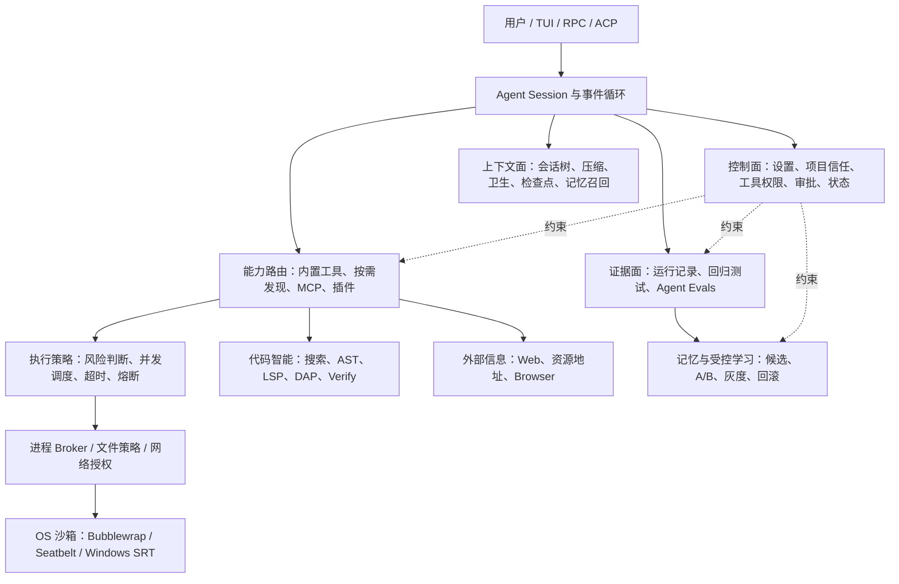

# Pi-go Coding Agent 工程档案

> 用途：项目复盘、架构回顾、简历提炼和面试准备
> 记录日期：2026-08-10
> 记录范围：当前 `pi-mono` 工作区中围绕 `packages/coding-agent` 完成的能力平台、安全沙箱、代码智能、上下文、评测、记忆、协议接入、性能和交互工程
> 状态说明：本文对应 2026-08-10 的代码收口基线，记录已实现并完成专项验证的工作区事实，不等同于已经发布的版本说明。正式发布仍需执行 release 流程和 CI 门禁。

## 1. 文档怎么用

这不是按提交时间排列的流水账，而是一份按系统能力组织的工程档案。

- 回顾项目：先看“项目总览”和“功能分块”。
- 查架构：看“系统架构”“关键问题与解法”和“ADR 索引”。
- 写简历：直接使用“简历素材”，再按自己的真实职责删改。
- 准备面试：使用“面试讲法”和 STAR 案例，不要只背功能名。
- 判断完成度：看每个模块的状态标签和“已知边界”。

本文使用四种状态：

| 标签 | 含义 |
|---|---|
| 已实现 | 当前工作树中已有功能代码和对应文档 |
| 已验证 | 有专项测试、集成测试或可复跑基准作为证据 |
| 已收口 | 功能代码、测试、文档和依赖记录已经在同一基线完成整理 |
| 设计边界 | 已明确架构和约束，不能据此声称已完成全部生产验证 |

职责归属不能只从 Git 工作树推断。简历中的“主导”“独立负责”“带领”等词，应按真实经历选择；本文只提供可以由代码、文档、测试和基准支持的技术表述。

## 2. 一页总览

### 2.1 项目定位

Pi 原本是一个轻量、可扩展的终端 Coding Agent。当前这轮工作的核心不是继续增加零散工具，而是把已有能力重组为一个可执行、可验证、可控制、可恢复的单代理工程平台：

```text
理解任务
  → 按需加载能力
  → 在权限和沙箱边界内执行
  → 通过类型检查、测试、Diff 或隐藏验收留下证据
  → 将有效事实沉淀为可失效记忆
  → 将重复失败转成受控改进候选
  → 经 A/B、灰度和用户批准后启用
  → 出错时熔断、回滚或降级
```

### 2.2 这轮工作的核心结果

1. 建立统一的主 Agent 能力平台，分开“用户允许使用”“本轮是否暴露给模型”“调用时是否批准”和“操作系统是否真正强制”四层状态。
2. 给内置文件与进程工具加入默认轻量沙箱，Windows 支持零配置受限令牌和一次安装后的独立用户 + WFP 强隔离。
3. 把读取、搜索、结构理解、编辑、调试和验证串成完整代码任务链路。
4. 建立本地确定性评测、隔离 Agent 能力评测、真实失败回归捕获和证据质量门。
5. 建立带来源、时效和失效机制的长期记忆，以及经过评测、灰度和回滚约束的受控自进化。
6. 接入 MCP、ACP 和受控插件，同时保留原有工具审批、超时、沙箱和项目信任边界；远程 MCP 增加 OAuth 2.1 凭据隔离，ACP 按客户端声明能力路由文件和终端操作。
7. 增加最多三个并发的隔离任务 Worker，在临时项目快照中执行 research/coding 子任务，结果由主 Agent 审阅，不自动合并写入。
8. 把多语言 AST、项目级 LSP broker、Eval 只读工具桥、外部信息平面和 Browser 2.0 收口为有界、可降级、可测量的能力面。
9. 对 Windows 开发启动路径做可复跑基准，Node 原生 TypeScript 路径把 RPC 可用中位时间从 6.165 秒降到 2.031 秒。

### 2.3 可量化能力基线

| 能力 | 当前基线 |
|---|---|
| AST | JavaScript、TypeScript、TSX、HTML、CSS、Python、Go、Rust、JSON、YAML、Markdown，共 11 种语言 |
| LSP | 15 项操作；TypeScript/JavaScript、Python、Go；自动诊断最多 8 个文件、20 条问题、2 轮反馈；本地 fixture 第二会话 2.948 ms，共享 attach P95 3.722 ms |
| DAP | 23 项操作；Python、JavaScript/TypeScript、Go；未调用时不启动后台调试进程 |
| 统一读取 | 文本、图片、网页、PDF、ZIP、TAR、TAR.GZ、GZ、内部 URI；归档单条目 20 MB、总声明 100 MB、最多 10,000 项 |
| 上下文生命周期 | 固定实验中消息 29 → 3，估算输入 48,910 → 7,850，减少 84.0%；报告 20.7 ms，恢复 0.2 ms |
| 外部信息 | 10/10 官方源首命中，平均 1.0 次工具调用，估算输入相对固定通用基线减少 69.11%，十次读取缓存命中率 90% |
| MCP | stdio、Streamable HTTP、SSE；工具、资源、提示词；OAuth 2.1 + PKCE；懒发现不阻塞主启动路径 |
| ACP | 与 TUI、RPC 共用一套 Agent 会话、工具和审批运行时；按客户端能力路由读、写、编辑和终端 |
| 隔离任务 Worker | research/coding 两类；最多 3 个并发；默认 300 秒；单结果最多 32 KiB；不自动合并 |
| 受控插件 | Extension、Skill、MCP、Resource；下载、校验、批准分离；逐文件 SHA-256；保留一个回滚版本 |
| 沙箱专项验证 | 最近一次聚焦验证覆盖 11 个测试文件、77 个用例；真实 Windows 集成覆盖直接出网拒绝和精确目的地授权 |
| 跨功能回归 | 已记录的能力平台基线为 15 个测试文件、105 个用例通过 |
| Windows 启动 | `--version` 中位 0.194 秒 → 0.092 秒；RPC 可用中位 6.165 秒 → 2.031 秒 |

这些数字的用途是建立可复跑基线，不是发布级 SLA。测试数量会随工作树变化，发布或投递简历前应重新生成一次最新记录。

## 3. 产品与工程原则

### 3.1 正确率优先于工具数量

项目不以“内置多少个工具”为目标，而以 Agent 是否能完成“找出问题、做出修改、验证结果、提供证据”的闭环为目标。工具增加后必须回答：解决了哪类任务、失败如何降级、权限是否扩大、Token 和延迟是否合理。

### 3.2 当前证据高于历史记忆

用户当前指令、当前代码、测试和工具结果始终高于旧记忆。项目记忆必须绑定文件证据；证据变化后停止使用，避免历史经验压过当前事实。

### 3.3 评测先于学习

模型认为“这个策略更好”不构成证据。行为改进必须绑定不可变摘要，在相同模型、工具、预算和隔离案例下做 A/B，再经过真实任务灰度和用户批准。

### 3.4 权限声明不等于安全边界

同进程 TypeScript 扩展仍拥有宿主用户权限。能力清单和审批用于治理正常工具调用；真正约束恶意或失控代码，需要进程外 broker、操作系统沙箱、容器或虚拟机。

### 3.5 可选能力失败时不能拖垮主任务

语义搜索、LSP、MCP、网页、记忆和缓存都采用懒启动、超时、熔断或明确降级。Agent 应在增强能力不可用时回到 `grep`、`read`、基础编辑和项目原生命令，而不是无限重试。

### 3.6 用户操作必须短

复杂能力被收敛到少量入口：`/tools`、`/permissions`、`/doctor`、`/git`、`/tests`、`/evals`、`/memory`、`/learn`。Windows 强沙箱只需要一次管理员安装，后续自动检测和选择后端。

## 4. 系统架构



### 4.1 控制面

控制面保存项目信任、工具开关、审批模式、持久权限、沙箱模式、评测器和学习候选状态。普通数据面不能自行修改权限、批准记录、隐藏测试或评分器。

### 4.2 数据面

数据面负责读取文件、修改代码、执行进程、访问网络、连接 MCP、控制隔离浏览器和调用语言服务器。所有模型驱动的内置能力必须先经过控制面判断。

### 4.3 证据面

证据面记录确定性结果：文件 Diff、测试状态、类型诊断、工具错误、延迟、Token、隐藏验收和回归测试。它用于回答“为什么说任务完成了”，也为记忆和学习提供受限来源。

### 4.4 进程外强制面

文件和网络边界最终由进程 broker 和操作系统后端执行。Linux 使用 Bubblewrap，macOS 使用 Seatbelt，Windows 使用受限令牌或独立低权限用户 + WFP。宿主进程内的权限提示不能替代这一层。

## 5. 功能分块

### 5.1 主 Agent 能力平台

状态：已实现；核心跨功能回归已记录。

#### 解决的问题

工具数量增加后，如果每个扩展自行处理启用、审批、超时、并发和错误，用户会看到不一致行为，模型也会在每轮承担越来越大的工具 Schema。

#### 主要实现

- 将能力注册、持久工具偏好、运行时暴露和调用时批准分开。
- `/tools` 负责允许或禁止能力；`tool_search` 只在需要时临时暴露最多两个低频工具。
- `/permissions` 管理 `allow`、`prompt`、`deny`；未知工具按 `exec` 风险处理。
- `Shift+Tab` 在便捷、写入确认和始终询问模式之间切换。
- 工具执行层统一提供 180 秒默认超时、连续三次失败熔断、30 秒恢复探测和脱敏错误。
- 共享/独占调度器保证只读能力可以有界并发，写入和状态变更按顺序执行。
- 重复失败保护会在相同参数连续得到相同错误后阻止机械重试；输入、错误、成功结果或新用户回合变化后重置。

#### 工程价值

这部分把“能调用一个工具”提升成“工具可发现、可授权、可观察、可降级”。后续增加 MCP、浏览器、调试器或插件时，不需要重新发明一套权限和运行机制。

#### 主要证据

- 架构：[agent-platform-architecture.md](agent-platform-architecture.md)
- 决策：[ADR 0034](adr/0034-main-agent-capability-platform.md)
- 测试：`tool-discovery*.test.ts`、`tool-approval.test.ts`、`tool-execution-protection-settings.test.ts`、`execution-controller.test.ts`

### 5.2 上下文、读取与可靠编辑

状态：统一读取、结构大纲、锚点编辑、上下文卫生和检查点/回退视图均已实现并完成专项验证。

#### 统一读取

`read` 统一处理本地文本、图片、网页、PDF、压缩包、`file://`、`pi://` 和扩展注册的内部资源。调用方不需要先猜文件类型或手动解压。

关键边界：

- 网页沿用 SSRF 和私网地址阻断，并标记为不可信内容。
- 压缩包拒绝路径穿越、绝对路径、ZIP64、异常压缩比和超大展开量。
- PDF 和网页最终仍受行数与字节上限约束。
- 外部资源不生成可编辑锚点，避免把不稳定内容当作本地文件修改依据。

#### 长文件结构大纲

长 TypeScript、JavaScript、TSX、HTML、CSS、Python 和 Go 文件先返回本地生成的结构大纲，再按精确范围展开。解析失败立即回退原文，不调用模型，也不依赖远端索引。

#### 锚点读取与原子编辑

普通文本读取返回文件版本和逐行锚点。`edit` 在写入前验证：文件版本未变化、锚点唯一、修改范围不重叠、结果确实发生变化。验证通过后用临时文件加重命名原子替换。

具体故障链：

```text
Agent 在第 10～12 行制定修改
  → 用户或另一个会话先改了文件
  → 旧行号仍然存在，但内容已经不同
  → baseHash / 行锚点校验失败
  → 整批编辑拒绝，不覆盖新内容
```

#### 结构化批量编辑

`ast_edit` 用 AST 模式和捕获组完成多文件重写，先生成统一 Diff，再确认、复核文件版本、原子写入；中途失败时逆序恢复全部已写文件。它适合真实调用替换，不会把注释和字符串中的同名文本一起改掉。

#### Provider 上下文卫生

完整会话继续保存在本地 JSONL；只有发送给模型的临时视图会移除重复、过期或超预算工具输出。近期结果、错误、图片、用户要求和头尾证据保留。文件成功修改后，旧读取结果在 Provider 视图中失效，避免模型继续依据修改前内容行动。

#### 上下文检查点与回退

`context_lifecycle` 使用追加式会话树保存检查点、预览、回退报告和恢复标记：

- 不改写或删除原始 JSONL 历史。
- 回退前展示 Token、消息和证据保留情况，并要求确认。
- 用会话、工作区、运行时和文件摘要做 compare-and-swap 检查。
- 保留用户要求、失败测试、批准/拒绝和确定性证据 ID。
- 回退只改变活动上下文，不恢复文件，也不写入长期记忆或学习系统。

固定长任务实验中，活动消息从 29 条降到 3 条，估算模型输入从 48,910 降到 7,850，减少 41,060，降幅 84.0%；报告生成耗时 20.7 ms，恢复活动视图耗时 0.2 ms。证据保留 98/98、用户要求保留 1/1、恢复标记 1/1，说明压缩收益没有依赖丢弃关键证据。

#### 主要证据

- 文档：[unified-read.md](unified-read.md)、[reliable-edit.md](reliable-edit.md)、[ast-edit.md](ast-edit.md)、[context-lifecycle.md](context-lifecycle.md)
- 决策：ADR 0001、0002、0006、0015、0041
- 测试：`unified-read.test.ts`、`reliable-edit.test.ts`、`smart-read.test.ts`、`ast-edit-extension.test.ts`、`context-hygiene.test.ts`、`context-lifecycle.test.ts`

### 5.3 本地代码智能平面

状态：基础搜索、语义搜索、11 语言 AST、项目 LSP broker、DAP、Verify 和 Eval 只读桥均已实现并完成专项验证。

#### Windows 原生搜索

内置 `grep` 和 `find` 优先使用受管的 `rg` / `fd`，不可用时使用并发文件系统回退。Windows 不再要求用户手工安装 WSL、Git Bash、`rg` 或 `fd` 才能完成基本代码搜索。PowerShell 直接启动，不嵌套在 Bash 中。

这里解决的是可用性和稳定性，不声称文件系统回退比原生 `rg` 更快；性能比较需要单独固定语料基准。

#### 语义代码搜索

`code_search` 使用 mgrep 做意图搜索，并有以下限制：

- 后台索引不阻塞主任务；前台预算 2 秒。
- 默认最多处理 5,000 个文件。
- 结果会自适应扩展，但不会无限加宽。
- 失败后熔断并回退到内置精确搜索。
- 自动清理 watcher，严格限制项目边界。

#### AST 搜索与修改

`ast_grep` 做只读结构搜索，`ast_edit` 做预览优先的结构化写入。统一 `LanguageRegistry` 把搜索与编辑放到同一语言检测、文件过滤和捕获组实现上，覆盖 JavaScript、TypeScript、TSX、HTML、CSS、Python、Go、Rust、JSON、YAML 和 Markdown。Python、Go、Rust、JSON、YAML 使用官方 ast-grep 语言包；JSON/YAML 写入后重新解析，Markdown 只支持有界代码块适配。未支持的结构模式明确报错，不用文字搜索冒充 AST。

#### LSP

LSP 负责定义、类型定义、引用、实现、悬浮信息、符号、诊断、安全重命名、文件重命名、代码动作、状态、重载、能力和受审批的原始请求，共 15 项操作。

设计重点：

- 首次按语言/工作区懒启动，后续复用。
- 写操作先预览，失败时回滚。
- 修改后只检查有限相关文件，不把整个项目诊断塞入模型上下文。
- 冷启动首轮没有诊断时，在同一预算内做一次确认，避免把“尚未发布诊断”误判为正常。
- 项目本地 broker 允许多个 Pi 会话共享同一语言服务器；IPC 或 broker 失败时只尝试一次会话私有进程接管。

本地 fake-LSP 基准中，冷启动 244.031 ms，第二会话 2.948 ms，减少 98.79%；共享 attach P50/P95 为 1.493/3.722 ms，故障后私有进程接管 83.279 ms。观测到一个 broker 和一个 fake LSP，语言服务器 RSS 约 70.02 MiB。这是固定本机 fixture，不外推为真实语言服务器 SLA。

#### DAP 调试

统一 DAP 客户端支持 Python、JavaScript/TypeScript 和 Go 的启动与进程/端口附加、线程、暂停、调用栈、变量、求值、源码、模块、重启和多类高级断点，共 23 项操作。

适配器能力会在调用前协商；不支持的操作直接说明。`disconnect` 只断开调试器，`stop` 才结束目标进程。调试目标默认不继承凭据环境变量。

#### Verify 与影响分析

`verify` 统一 TypeScript/JavaScript、Python 和 Go 的类型检查、测试和 lint。`auto` 根据修改路径和有界依赖图选择相关测试，不会无提示扩大为全仓测试。失败输出只返回关键行，完整捕获日志保存在本地。

#### 主要证据

- 文档：[local-code-intelligence-plane.md](local-code-intelligence-plane.md)、[lsp.md](lsp.md)、[dap-architecture.md](dap-architecture.md)、[verify.md](verify.md)
- 测试：`native-file-search.test.ts`、`ast-grep-extension.test.ts`、`ast-multilingual.test.ts`、`lsp-extension.test.ts`、`debug-extension.test.ts`、`verify-extension.test.ts`、`verify-impact-analysis.test.ts`

### 5.4 Git、工作区恢复与后台进程

状态：已实现。

#### 结构化 Git

模型不能传任意 Git 参数，而是调用受限操作：状态、Diff、日志、精确暂存、取消暂存、提交、推送、提交计划、冲突检查和冲突解决。

关键保护：

- 提交计划必须恰好覆盖当前变更一次，拒绝遗漏、重复、未知路径和依赖环。
- 冲突预览有界展示 base、ours、theirs，并携带索引指纹。
- 选择整文件版本或标记手工结果时重新检查指纹，防止读取后状态变化。
- 精确暂存失败会恢复工作区文件。
- 不提供强制推送、硬重置和删除分支等高风险任意操作。
- 推送始终确认。

#### 回合级撤销

`/undo-turn` 为 Agent 每回合的文件变化保存工作区快照。撤销前预览文件，确认用户在 Agent 完成后是否又改过内容；存在冲突时拒绝覆盖。它不修改 Git 历史，并支持多文件失败回滚和并发会话锁。

#### 任务台账

`todo` 使用稳定 ID、修订号和完成证据跟踪长任务。它保存于会话分支，恢复会话后继续工作；上下文中只注入有界提醒，不把完整计划反复发送给模型。

#### 隔离任务 Worker

`task` 把可并行的 research/coding 子任务放进临时项目快照，而不是让多个 Agent 共享同一工作区写入：

- 最多同时运行三个 Worker，默认硬超时 300 秒。
- research 只读和搜索；coding 可以写文件和执行命令，但不能递归创建新任务。
- 每个结果最多返回 32 KiB，并附带状态、耗时和快照位置。
- Worker 修改不会自动进入主工作区；主 Agent 必须检查快照、选择性应用并重新验证。
- 会话退出时清理临时快照，失败或超时不会拖住主 Agent 的后续工具调用。

这套设计用隔离换取并行：它避免多个模型同时修改同一文件造成隐式覆盖，也避免“子 Agent 完成”被误解为“主项目已合并并通过验证”。

#### 后台进程

`process` 直接启动可执行文件和参数数组，用于开发服务器和 watcher。日志按游标增量读取，最多管理八个当前会话创建的进程，退出时自动清理。它不解析管道、重定向或 `&&`，也不会停止其他会话的进程。

#### 主要证据

- 文档：[git-tool.md](git-tool.md)、[turn-undo.md](turn-undo.md)、[task-ledger.md](task-ledger.md)、[task-workers.md](task-workers.md)、[process-tool.md](process-tool.md)
- 决策：ADR 0003、0007、0044
- 测试：`git-tool.test.ts`、`git-workflow.test.ts`、`turn-undo-service.test.ts`、`task-ledger-state.test.ts`、`task-extension.test.ts`、`process-manager.test.ts`

### 5.5 权限、项目信任与默认轻量沙箱

状态：已实现；Windows 强后端已在本机完成一次安装和专项集成验证。

#### 三层防护

```text
项目信任：是否加载项目自己的设置、扩展、Skill 和 MCP
  ↓
工具审批：这次调用是否允许执行
  ↓
OS 沙箱：即使调用失控，进程实际能读、写、联网到哪里
```

项目信任不是沙箱。它只防止陌生仓库在启动阶段静默加载本地扩展或配置。工具审批也不是操作系统强制边界；最终隔离由进程 broker 和平台后端完成。

#### 默认模式

```bash
PI_SANDBOX_MODE=auto          # 默认；工作区与私有临时目录可写
PI_SANDBOX_MODE=read-only     # 工作区只读，私有临时目录可写
PI_SANDBOX_MODE=full-access   # 明确选择宿主执行
```

非法模式或初始化失败会停止操作，不会静默退回宿主执行。沙箱子进程只接收白名单环境，Provider Key、Pi 会话路径、运行时注入变量和不可信代理变量不会下传。

#### 文件与进程边界

- `read`、`write`、`edit`、`grep`、`find`、`ls` 和 shell 使用规范化工作区策略。
- 符号链接和 Windows junction 解析不能扩大边界。
- 已存在的 `.git`、`.pi`、`.env*`、凭据目录和工作区外写入默认拒绝。
- 搜索子进程、内置 shell 和通过 `pi.exec()` 的扩展调用复用进程 broker。
- Pi 自身 Agent 目录加入沙箱保护根，普通沙箱任务不能读取或修改权限、会话、记忆和网络授权记录。

#### 平台后端

| 平台 | 后端 | 主要边界 |
|---|---|---|
| Linux | Bubblewrap + namespace + seccomp | 工作区写入限制、敏感控制路径保护、默认无网络 |
| macOS | Seatbelt | 工作区写入限制、敏感控制路径保护、默认无网络 |
| Windows 零配置 | restricted token + capability SID + ACL + Job Object | 可靠限制写入和进程树资源；仍保留宿主文件读取和直接网络能力 |
| Windows 强后端 | 独立 `srt-sandbox` 用户 + ACL + WFP | 低权限账户执行、工作区会话 ACL、直接出网阻断、按需精确网络授权 |

#### Windows 强后端的一次性安装

本机执行记录：

```powershell
npx --yes @anthropic-ai/sandbox-runtime@0.0.71 windows-install
```

安装器已创建专用 `srt-sandbox` 用户，输出说明无需注销。安装器当时报告 `WFP: cannot-read, 0 filters`；Pi 不依赖这个显示值判断安全，而是在启动时对 WFP 隔离做行为验证，异常时失败关闭。

后续不需要用户逐次运行安装命令。Pi 会自动检测强后端；`/doctor` 显示 `srt-windows` 或 `restricted-token`。最近一次真实集成验证确认：

- 未授权的直接网络出口被 WFP 拒绝。
- 通过 Pi 代理批准的精确目的地可以访问。
- 用户自己的网络不受专用沙箱 SID 过滤规则影响。

#### Windows helper 完整性修复

实际故障：安装在用户桌面路径中的 vendored helper 对低权限沙箱账户不可执行，导致强后端虽然安装成功，命令仍无法启动。

解法：

1. 启动时把固定版本 helper 复制到随机的进程级 `C:\ProgramData\pi-sandbox\session-*` 目录。
2. 给沙箱账户只读和执行权限，不给修改权限。
3. 每次启动前校验 SHA-256，防止 helper 被替换。
4. reset 时删除临时目录。

这不是单纯“换一个路径”，而是同时解决可执行性、完整性和生命周期清理。

#### 按需网络授权

Linux、macOS 和 Windows 强后端的静态网络白名单为空。命令首次请求具体目的地时，交互界面提供：

```text
拒绝（默认）
只允许当前命令访问精确 host:port
当前 Pi 会话允许
当前工作区永久允许
```

关键约束：

- 只允许精确主机和端口，不支持通配符；未知端口拒绝。
- 无确认 UI、取消、新目的地的 headless 请求全部拒绝。
- 数字 IP 简写先规范化；回环、私网、链路本地、组播和云元数据地址额外警告。
- 相同目的地的并发请求合并；不同提示串行；单命令最多八次提示。
- 无法可靠判断是哪条并发命令发起请求时拒绝，而不是放大授权范围。
- 工作区授权按内容寻址存放于 `~/.pi/agent/network-permissions`，只保存规范化工作区和精确目的地，不保存凭据。
- 授权记录损坏、路径异常或目的地格式异常时拒绝。

#### 明确限制

同进程 Extension、Skill 中的原生 Node API 和宿主控制逻辑仍是受信代码，可以绕过内置 broker。恶意仓库、无人值守任务或高对抗场景仍应把整个 Pi 放入容器、VM 或微虚拟机。

#### 主要证据

- 文档：[security.md](security.md)、[containerization.md](containerization.md)
- 决策：ADR 0020、0033
- 测试：`sandbox-default.test.ts`、`sandbox-policy.test.ts`、`sandbox-controller.test.ts`、`sandbox-command.test.ts`、`sandbox-network-permissions.test.ts`、`windows-srt-backend.test.ts`、`windows-sandbox-launcher.test.ts`、`unix-sandbox-backend.test.ts`

### 5.6 外部信息、浏览器、MCP、ACP 与插件

状态：统一外部信息平面、Browser 2.0、MCP/OAuth、ACP 客户端能力路由和受控插件均已实现并完成专项验证。

#### Web 搜索和读取

- `web_search` 默认可使用无 Key 的 DuckDuckGo，配置 `BRAVE_API_KEY` 后可用 Brave。
- `web_fetch` 和统一 `read` 做可读正文提取、私网阻断、重定向复核、响应大小和超时控制。
- 网页结果始终带不可信内容标记，不能自行改变权限或项目规则。

#### 统一外部信息平面

外部信息平面把官方 API、站点解析和普通搜索收敛到一个有界状态机。它支持 `github://`、`gitlab://`、`npm://`、`pypi://`、`crates://`、`go-package://`、`arxiv://` 和 `osv://` 等只读地址。

选择顺序是：官方结构化端点 → 站点专用解析 → 通用网页提取 → 一次普通搜索降级。每个结果记录来源地址、读取时间、内容类型、缓存、截断、不可信标记和内容 SHA-256。

固定十题验证中，官方源首命中 10/10，平均模型可见工具调用 1.0 次，验证器 P50/P95 为 0.130/1.859 ms；平均估算输入 132.2 tokens，相对固定 428-token 通用搜索基线减少 69.11%。十次同资源读取只发生一次上游 fetch，缓存命中率 90%；三个同 key 并发读取共用一次填充。

#### 隔离浏览器

`browser` 使用 Chrome DevTools Protocol 控制临时浏览器配置，支持语义快照、引用点击/输入、控制台、截图和生命周期管理。默认不读取个人 Cookie、密码、历史或扩展。

Browser 2.0 进一步增加多标签页、有界等待、快照版本、工作区内上传和固定下载目录。关闭标签会等待 CDP 目标真正消失，切换标签会清空旧页面的网络请求状态。旧元素引用在页面变化后失效，操作前拒绝，不会点击错误对象。真实本地 Chromium 集成覆盖 18 组能力，并验证过期引用和工作区外上传拒绝。

#### MCP

MCP 支持 stdio、Streamable HTTP 和 SSE。用户配置、可信项目配置、受控插件和 ACP 会话配置可以组合；后来源覆盖同名服务。

- 工具映射为 `mcp__服务名__工具名`，继续走本地风险审批。
- 资源转成 `mcp://` 地址，再交给统一 `read`。
- 提示词通过明确命令列出和调用。
- 启动阶段只加载安全缓存，后台懒连接；一个服务失败不阻塞主任务。
- URL 凭据被拒绝，密钥不会进入缓存指纹和状态输出。
- 远程服务可通过 OAuth 2.1 discovery、动态注册、PKCE、state 和 issuer 校验授权；回调只监听 `127.0.0.1`。
- Token 保存在 `auth.json` 的服务名 + URL 摘要命名空间，不进入 `mcp.json`、发现缓存或错误输出；后台发现只报告 `authorization_required`，不会弹出交互授权。

#### ACP 编辑器模式

ACP 是同一 Agent 运行时的传输适配层，不是第二个 Agent。编辑器可以新建、恢复、加载和列出会话，接收文本、图片和资源，观察思考、工具调用、结果和 Token，并把会话级 MCP 与权限请求映射到 Pi 的现有规则。

客户端声明 `fs.readTextFile`、`fs.writeTextFile` 或终端能力时，Pi 会在工具审批通过后把 `read`、`write`、`edit`、`bash` 路由到客户端；`edit` 同时要求读写能力。已选择的客户端操作失败后不会自动在本地重试，避免写入或命令被重复执行。

因此 TUI、RPC、ACP 共享路径边界、沙箱和审批状态，不会出现“编辑器模式比终端模式权限更大”的旁路。

#### 受控插件供应链

插件把 Extension、Skill、MCP 配置和只读资源放进一个 `pi-plugin.json` 清单。下载、校验、启用分为三步：安装成功不等于获得运行权限。

校验覆盖：

- 逐文件 SHA-256 和清单指纹。
- 路径越界、符号链接、重复声明、缺失文件、大小和版本兼容性。
- npm、pnpm、Bun 一律禁用生命周期脚本。
- 文件或清单变化后重新批准。
- 更新时先原子备份旧版本，安装或批准失败自动恢复；保留一个已验证版本供回滚。

#### 主要证据

- 文档：[external-information-plane.md](external-information-plane.md)、[browser-tool.md](browser-tool.md)、[mcp.md](mcp.md)、[acp.md](acp.md)、[plugins.md](plugins.md)
- 决策：ADR 0012、0016、0037、0038、0039、0041、0045、0046
- 测试：`web-extension.test.ts`、`external-resources.test.ts`、`research-engine-2.test.ts`、`browser-cdp.test.ts`、`browser-2-integration.test.ts`、`mcp-extension.test.ts`、`acp-mode.test.ts`、`plugin-*.test.ts`

### 5.7 验证、评测与真实回归

状态：已实现；Eval 解释器的有界只读工具桥已完成专项验证。

#### 三个入口明确分工

```text
/tests      运行已批准的代码回归，不调用模型
/evals      启动全新 Agent 做真实任务，会消耗模型 Token
/evals-dev  检查评测器自身的统计、报告和基线，不衡量 Agent 能力
```

#### 本地确定性评测

评测基础定义 `RunRecord`、`EvalCase` 和 `EvalReport`，记录脱敏 Token、成本、重试、工具错误、验证和耗时。十个离线案例只验证评测基础设施稳定，不用于声称 Agent 整体变强。

#### 隔离 Agent 能力评测

每个能力案例在独立临时项目中启动一个全新 RPC Agent，覆盖代码定位、Bug 修复、修改后验证、失败恢复、范围控制和持久记忆。Agent 完成后才注入隐藏验收，避免它修改评分器或针对公开答案刷分。

每个案例：

- 最长两分钟。
- 限制输出 Token 和工具调用数。
- 运行前明确确认模型成本。
- 记录工具链、最终回答、隐藏验收、延迟和 Token 分解。
- 自动与同案例上一次运行做中性数值比较，不自动下“提升”结论。

#### 可展开执行证据

评测报告默认只显示通过数、耗时、Token 和工具次数；`Ctrl+O` 展开准备、启动、工具调用、Agent 工作、隐藏验收和清理链路。报告只在本地渲染，不进入模型上下文。

#### 从真实失败制作回归

只有出现“失败 → 修改代码 → 后续验证通过”时，系统才提出制作最小回归测试。整个流程有两次用户确认：允许生成、确认写盘。

写盘前的本地质量门要求：

- 使用支持的测试框架和真实断言。
- 引用真实项目模块、包、CLI 或 Go 调用。
- 拒绝只在测试文件内定义假函数再断言的自证型测试。
- 最多两个新测试文件、4,000 字符，只写测试路径，不覆盖已有文件。
- 检测密钥、私钥、绝对用户路径和危险控制字符。
- 任一步骤失败回滚本轮新文件。

#### Eval 只读工具桥

Python/Bun Eval 桥只暴露 `read`、`grep`、`find`、`ls` 固定白名单。每个单元默认最多八次调用，参数 16 KiB，单次输出 32 KiB，并共享单元超时和取消信号。解释器不能把桥接协议变成任意 Pi 工具入口。

#### 主要证据

- 文档：[evals.md](evals.md)、[local-code-intelligence-plane.md](local-code-intelligence-plane.md)
- 决策：ADR 0022～0029、0043
- 测试：`evals.test.ts`、`eval-extension.test.ts`、`agent-evals.test.ts`、`eval-capture.test.ts`、`eval-case-runner.test.ts`

### 5.8 证据型记忆与受控自进化

状态：已实现。

#### 长期记忆

记忆不是聊天记录仓库，而是少量带证据、能失效、能删除的事实。支持：

- `remember`：用户明确要求保存事实，确定性校验后直接写入。
- `propose`：Agent 每个任务最多提出一个候选，立即交给用户批准、拒绝或稍后处理。
- `recall`：本地检索最多五条，不调用模型或向量服务。
- `feedback`：记录 adopted、helpful、harmful、neutral 使用结果。
- `forget`：按准确 ID 删除，并清理派生索引。

项目、经历和方法记忆绑定项目文件及最多五段证据。精确原文移动行号后可以重新定位；原文被删除或改变时，记忆自动停止使用。凭据、权限批准和安全绕过不能保存为记忆。

#### 受控自进化

普通任务只保存不可逆错误指纹和脱敏指标。相同失败在同一项目重复达到阈值后，系统先询问用户是否花一次模型调用生成最小候选。

第一版候选只有两类：

- `prompt`：项目级短行为规则。
- `strategy`：仅任务命中触发词时注入。

生命周期：

```text
重复信号
  → 用户允许制案
  → 冻结候选与 SHA-256
  → 同模型、同案例、同工具、同预算 A/B
  → 用户批准 canary
  → 匹配的低风险真实任务观察
  → 正式推广或拒绝
  → 失败自动停用，随时回滚上一稳定版本
```

候选不能修改权限、审批、安全策略、依赖、安装脚本、工具能力或核心代码。生成阶段不开放文件、网络和命令工具；灰度阶段阻止终端、推送、浏览器和生产凭据。评测、批准和启用必须绑定同一内容摘要。

#### 工程价值

这部分把“Agent 会记住”和“Agent 会自我改进”从宣传概念变成可审计状态机：事实有来源，策略有对照，推广有门禁，失败有回滚。

#### 主要证据

- 文档：[memory.md](memory.md)、[self-evolution.md](self-evolution.md)
- 决策：ADR 0018、0019
- 测试：`memory-storage.test.ts`、`memory-extension.test.ts`、`learning.test.ts`、`learning-extension.test.ts`、`memory-agent-protocol.test.ts`

### 5.9 TUI、配置与可运维性

状态：已实现。

#### 用户入口

| 入口 | 作用 |
|---|---|
| `/api` | 配置 OpenAI Responses、OpenAI Chat Completions 和 Anthropic Messages 兼容 Provider，并立即切换模型 |
| `/model` | 选择模型和该模型真实支持的思考等级 |
| `/tools` | 启用、禁用和查看工具风险；低频工具是否暴露由按需发现决定 |
| `/permissions` | 管理每个工具的持久执行策略 |
| `/doctor` | 离线检查模型、核心工具、shell、LSP、搜索、Web、配置和沙箱后端 |
| `/git`、`/process`、`/tasks` | 管理版本、后台进程和长任务状态 |
| `task` | 在隔离项目快照中并行执行 research/coding 子任务，由主 Agent 审阅结果 |
| `/mcp auth` | 为需要授权的远程 MCP 发起本机回环 OAuth 流程 |
| `/tests`、`/evals` | 分开代码回归和真实 Agent 能力评测 |
| `/memory`、`/learn` | 管理长期事实和受控行为候选 |

#### 双语界面

语言支持自动系统检测、简体中文和英文，运行时立即切换。消息字典有类型约束和英文回退，覆盖设置、模型、思考、编辑器、页脚、审批和评测等核心界面。

#### Express Track 视觉系统

TUI 使用响应式启动标识、冰蓝/暖白语义色、连续交互轨道、统一浮层、输入边框状态和稳定双行页脚。默认界面保持安静，详细工具输出和评测轨迹通过 `Ctrl+O` 展开。

全屏退出行为也变成显式设置：用户可以选择退出后打印最终对话，或只显示恢复当前会话的短提示，避免长记录污染终端。

用户提交后消息立即进入对话，再执行提示词预处理；输入被转换时原位协调，预处理失败时恢复编辑器。流式状态把首 Token 延迟（TTFT）、活跃输出吞吐（tok/s）和端到端耗时（E2E）分开，避免用整段平均 TPS 掩盖首包慢或中途停顿。

#### 离线诊断

`/doctor` 不联网、不调用模型、不读取凭据内容、不启动 shell/LSP/mgrep，也不自动修改配置。它区分错误、提醒、可选和正常，并给出最短修复方式。Windows 沙箱后端也在这里显示。

#### 主要证据

- 文档：[doctor.md](doctor.md)、[tool-approval.md](tool-approval.md)、[tool-discovery.md](tool-discovery.md)
- 测试：`i18n.test.ts`、`express-track-theme.test.ts`、`doctor-*.test.ts`、`settings-selector.test.ts`、`tools-extension.test.ts`

### 5.10 启动、缓存与运行性能

状态：已实现并有本机原始样本。

#### 启动路径优化

- PowerShell 开发脚本从 `tsx` 改为 Node 原生 TypeScript strip-only，仍直接执行源码。
- `--version` 使用 bootstrap-only 早返回，不加载完整 Agent。
- 拆分 Node CLI bundle，懒加载运行模式和可选解析器。
- Web 解析、MCP、LSP、语法高亮、HTML 导出和平台沙箱运行时均推迟到首次使用。
- 确定性扩展并发导入，模型与资源初始化重叠。
- 复用模型主机预连接。
- 缓存 PATH 感知的工具/shell 解析与页脚会话统计；系统提示不变时跳过完整动态上下文前缀扫描。
- Windows 原生启动 `rg` / `fd`，减少 shell 中转。
- 共享/独占工具调度减少不必要串行等待。
- 用原生 Chat Completions HTTP 流替换继承的 Mistral SDK 传输，移除生成客户端和 Schema 运行时开销。

#### Windows 基准结果

测量环境：Windows `10.0.26200` x64、Intel Core Ultra 7 255HX、约 31.5 GiB 内存、Node v24.13.1。每个场景预热一次、交错测量七次，离线、不调用模型。

| 场景 | `tsx` 中位 | Node 原生中位 | 中位延迟降低 | 加速 |
|---|---:|---:|---:|---:|
| `pi-dev --version` | 0.194 秒 | 0.092 秒 | 52.6% | 2.11 倍 |
| RPC `get_state` 可用 | 6.165 秒 | 2.031 秒 | 67.1% | 3.03 倍 |

| 场景 | `tsx` P95 | Node 原生 P95 | P95 延迟降低 |
|---|---:|---:|---:|
| `pi-dev --version` | 0.211 秒 | 0.124 秒 | 41.1% |
| RPC 可用 | 7.438 秒 | 2.374 秒 | 68.1% |

原始样本：[2026-08-10-windows-pi-dev.json](benchmarks/2026-08-10-windows-pi-dev.json)。七次本机样本适合比较开发启动体验，不代表线上 SLA。

#### Provider 上下文与缓存

- 确定性上下文卫生减少过期和重复工具输出，但保留完整本地历史。
- cache guard 经过目标 Provider A/B 后保持默认关闭：观测到 cache read 没有改善，未缓存输入反而增加。
- 显式缓存断点在隔离请求中出现 502，因此没有因为理论上“应该更快”而默认启用。
- 缓存策略采用可观测、可禁用和失败开放原则，不让缓存故障中断正确任务。
- OpenAI Responses 延续状态只保存 prompt、output 和工具形状的 SHA-256 摘要与字节数，不保留原始提示词、输出或工具文本；实现使用 Web Crypto，可通过浏览器兼容检查。

#### 主要证据

- 文档：[performance.md](performance.md)、[prompt-cache-runtime.md](prompt-cache-runtime.md)
- 决策：ADR 0024、0030～0032、0035、0040
- 脚本：`scripts/benchmark-pi-dev.mjs`、`scripts/benchmark-pi-dev.test.mjs`

## 6. 关键工程问题与解法

### 6.1 Windows 沙箱“安装成功但 helper 启动失败”

问题：强沙箱使用独立低权限用户。vendored helper 位于用户桌面路径时，该账户不能穿过上级目录执行文件。

短 trace：

```text
安装器完成
  → Pi 检测到强后端
  → 低权限用户启动 helper
  → 上级目录 ACL 阻断
  → 强后端不可用
```

解法：把固定 helper 物化到随机 ProgramData 会话目录，授予最小读执行 ACL，每次启动校验 SHA-256，reset 时清理。这样同时解决路径可达、二进制防替换和临时文件生命周期。

为什么必要：只放宽桌面目录 ACL 会扩大用户目录暴露；只复制文件不校验摘要又引入替换风险。

### 6.2 默认断网与用户确实需要联网的冲突

问题：静态允许整个网络会失去沙箱意义；完全断网又让包下载、API 和文档访问不可用。

解法：把网络从“沙箱启动配置”变成“命令运行时的精确目的地授权”。授权绑定 `host:port` 和命令/会话/工作区生命周期，代理负责转发，沙箱进程不能直接出网。

必要性：授权 `https` 或某个工具名仍然过宽；只有精确目的地、调用归属和并发歧义拒绝，才能控制真实故障半径。

### 6.3 行号编辑覆盖并发修改

问题：模型依据旧行号修改时，另一个窗口可能已经改了文件。传统文本替换可能命中相似内容并覆盖用户变化。

解法：读取返回文件 revision 和逐行锚点；编辑在写盘前一次验证全部范围，再原子替换。结构化多文件修改额外提供全批预览和回滚。

必要性：单纯“写前再读一次”不能证明模型修改意图仍对应同一段内容，也不能保证多文件事务一致。

### 6.4 Agent 评测由自己证明自己正确

问题：如果 Agent 能看到或修改测试，它可以输出表面正确结果、针对固定答案刷分，甚至修改评分器。

解法：在临时项目运行全新 Agent，结束后才注入隐藏验收；评分器和测试位于候选不可写位置。真实回归测试还要求失败、代码修改和通过验证三段证据。

必要性：模型裁判适合补充定性判断，但不能替代类型检查、测试、文件状态和隐藏验收。

### 6.5 长期记忆变成过期指令

问题：直接保存聊天总结会混入猜测、旧路径和外部提示注入，之后被当作当前事实使用。

解法：事实结构化为主体、属性和值；项目类记录必须绑定文件证据，证据变更自动失效；自动总结只进入候选，用户批准后才生效。

必要性：向量相似度只能回答“像不像”，不能回答“现在是否仍然为真”。

### 6.6 插件安装等同于取得权限

问题：普通包管理器下载后即可执行代码，生命周期脚本、清单漂移和更新失败都会扩大供应链风险。

解法：下载、逐文件校验和显式启用三阶段分离；禁用生命周期脚本；批准绑定清单指纹；更新采用原子备份和回滚。

必要性：只验证包来源无法证明本地实际文件没有变化，也无法处理更新一半失败。

### 6.7 性能优化只有“感觉更快”

问题：启动链路同时受磁盘缓存、进程热度和执行顺序影响，单次 stopwatch 不能支持结论。

解法：记录机器、Node、源码基点和 dirty 状态；预热；交错运行 baseline/candidate；保存七次原始样本、中位和 P95；区分短命令与完整 RPC 初始化。

必要性：没有原始样本和复跑命令的百分比，无法判断优化、噪声或环境变化。

## 7. 架构决策索引

当前 ADR 存在历史重复编号，引用时应同时写编号和文件名。

| 领域 | ADR |
|---|---|
| 读取、编辑、上下文 | 0001 结构大纲；0002 Provider-only 上下文卫生；0006 统一 Diff/结构编辑；0015 过期读取失效；0041 追加式上下文视图 |
| 任务、运行与恢复 | 0003 任务台账；0007 回合撤销；0008 事件驱动单 Agent；0009 本地指标；0015 会话后台进程；0044 隔离任务 Worker |
| 权限与安全 | 0005 审批快捷切换；0006 持久工具审批；0013 权限管理；0020 进程外强制；0033 默认轻量 OS 沙箱 |
| 代码智能 | 0010 持久 Eval 进程；0011 通用 DAP；0017 有界影响分析；0042 项目 LSP broker；0043 Eval 只读桥；0047 官方 AST 语法与统一注册表 |
| Git | 0009 单一结构化 Git；0036 提交计划与冲突解决 |
| Web 与浏览器 | 0012 有界 Web 隔离；0016 CDP 浏览器；0041 统一外部信息平面 |
| 评测、记忆、学习 | 0018 评测门禁自进化；0019 证据型记忆；0022 确定性评测；0023 回归捕获；0025 内部回归运行器；0026 证据质量门；0027 分离测试/评测；0028 隔离 Agent Evals；0029 可展开轨迹 |
| UI 与国际化 | 0014 语义 TUI；0021 双语设置 |
| 启动与缓存 | 0024 Node 原生开发启动；0030 尾部上下文剪枝；0031 共享前缀路由；0032 分段显式缓存；0035 自适应缓存；0040 网关重试；0040 懒启动/原生搜索/调度 |
| 平台与协议 | 0034 主 Agent 能力平台；0037 ACP 单运行时；0038 受控插件；0039 MCP 懒能力桥；0045 ACP 客户端能力路由；0046 MCP OAuth 凭据边界 |

完整文件位于 [adr/](adr/)。

## 8. 验证与证据台账

### 8.1 已有证据

| 范围 | 证据 |
|---|---|
| 本轮变更专项 | 65 个测试文件、608 个测试通过：coding-agent 60/566，agent 1/27，AI 1/7，evals 1/3，脚本 2/5 |
| 能力平台跨功能 | 性能文档记录 15 个测试文件、105 个用例通过 |
| Windows 沙箱 | 本轮聚焦运行 8 个测试文件、47 个用例通过；其中已安装 SRT 真实集成 7/7 通过 |
| Windows WFP | 真实集成验证：直接出网拒绝；精确批准目的地通过 |
| 外部信息与 Browser 2 | 官方源首命中 10/10，固定输入估算减少 69.11%，缓存命中 90%；真实 Chromium 集成连续复跑通过 |
| 本地代码智能 | 11 种 AST 语言、15 项 LSP 操作、共享 broker、故障私有接管和 Eval 只读桥均有专项测试及固定 fixture 基准 |
| 上下文生命周期 | 消息 29 → 3、估算输入减少 84.0%，关键证据、用户要求和恢复标记全部保留 |
| 安全审查 | 沙箱和网络授权专项审查未发现新的高风险问题；并发命令归属不明确时采用拒绝策略 |
| 启动性能 | 两份 JSON 保存机器、版本、运行方法和全部原始样本 |
| 评测系统 | 离线确定性案例、隔离 Agent 案例、隐藏验收和前次运行比较均有专项测试 |
| 可靠编辑 | stale file、锚点歧义、原子写入和多文件回滚有专项测试 |
| Git | 提交计划、依赖环、冲突指纹、精确暂存和失败回滚有专项测试 |
| 静态检查 | `npm run check` 全部通过：Biome、固定依赖、TypeScript 导入、shrinkwrap、install-lock、tsgo 和浏览器兼容检查 |

### 8.2 不能越界解释的地方

- 65/608 是本轮新增或修改测试的分组专项结果，不等于所有平台上的全仓测试总数。
- 十个离线 Eval 案例证明评测器能工作，不证明 Agent 整体能力提升。
- 七次 Windows 样本说明该机器上的开发体验，不是跨机器性能承诺。
- LSP、DAP、远端 MCP、网页和 PDF 延迟受外部进程、文件和网络影响，没有合并成一个误导性平均数。
- Windows 上通过 Git Bash 执行 `./test.sh` 的全仓测试仍包含非管理员软链接 `EPERM`、MSYS 路径转换和 Unix socket 不适用等平台失败；不能把专项通过解释为全平台测试全部通过。

### 8.3 发布前建议重新执行

```text
1. 固定工作树并确认没有其他会话改同一批文件
2. 运行本轮新增或修改的专项测试
3. 运行 npm run check
4. 复查 package-lock、install-lock 和 npm-shrinkwrap 一致性
5. 复跑 Windows 沙箱行为验证和 /doctor
6. 需要公开性能数字时复跑 benchmark:pi-dev 并保存新原始样本
```

## 9. 当前边界与未完成项

1. 本文对应代码收口提交，不替代正式 release note、版本号、发布制品和 CI 结果。
2. 同进程扩展是受信代码。能力清单、项目信任和工具审批不能约束扩展直接调用 Node 原生 API。
3. Windows 零配置 `restricted-token` 后端能限制写入和进程树资源，但不能阻断宿主文件读取和直接网络；强隔离需要一次安装 `srt-windows`。
4. Prompt injection 仍是本地 Agent 的固有风险。网页、仓库注释、文档和工具输出只能被标记为不可信，不能保证模型永远不受影响。
5. 上下文检查点、统一外部信息平面、多语言 AST、LSP broker 和 Eval bridge 已完成专项验证，但跨平台兼容和真实外部服务矩阵仍需持续扩充。
6. 真实 Agent Evals 当前每类案例仍少，适合作为门禁雏形，不足以形成统计显著的总体成功率结论。
7. 本地搜索回退的首要目标是 Windows 可用性，尚未建立与 `rg` 的统一速度和召回率基准。
8. 强沙箱限制的是模型驱动的内置工具。整个 Pi 进程、用户安装扩展或高风险无人值守任务仍应放入容器/VM。

## 10. 简历素材

以下内容按实际职责选择。没有实际主导就把“主导”改成“参与设计并实现”；没有负责发布就不要写“落地生产”。

### 10.1 项目名称建议

```text
Pi-go：可评测、可记忆、可恢复的本地 Coding Agent 能力平台
```

安全方向可以写：

```text
Pi-go Coding Agent 轻量沙箱与能力治理平台
```

### 10.2 一句话项目描述

```text
在 TypeScript/Node.js 单体仓库中，将轻量终端 Coding Agent 扩展为具备统一能力治理、OS 级沙箱、代码智能、证据评测、长期记忆和受控学习闭环的本地工程平台。
```

### 10.3 技术栈

```text
TypeScript、Node.js、Bun、Vitest、node:test、PowerShell、Git、JSONL、
LSP、DAP、CDP、MCP、ACP、Bubblewrap、Seatbelt、Windows Restricted Token、
Windows Filtering Platform、ACL、Job Object、SHA-256、HTTP/SSE/NDJSON
```

### 10.4 通用版简历要点

建议从下面选择 4～6 条，不要全部堆进一段经历。

- 设计并实现统一 Coding Agent 能力平台，将工具注册、按需暴露、风险审批、并发调度、超时熔断和降级恢复收敛到同一执行链路，避免新增能力各自维护一套控制逻辑。
- 为模型驱动的内置文件与进程工具实现默认失败关闭沙箱，覆盖 Linux Bubblewrap、macOS Seatbelt、Windows restricted token/ACL/Job Object，以及一次安装后的独立低权限用户 + WFP 网络隔离。
- 设计精确 `host:port` 按需网络授权，支持命令、会话和工作区生命周期，处理并发请求合并、归属歧义、私网/元数据地址警告、headless 拒绝和持久授权损坏等边界。
- 打通读取、精确搜索、AST、LSP、DAP、可靠编辑和 Verify 链路；AST 统一支持 11 种语言，LSP 提供 15 项操作和项目级共享 broker，DAP 提供 23 项操作。
- 实现最多三个并发的隔离任务 Worker，在临时项目快照中区分只读研究与编码执行，限制超时和输出，由主 Agent 审阅后选择性应用，避免多 Agent 共享写入冲突。
- 构建官方源优先的外部信息平面和 Browser 2.0；固定十题首命中率 100%、平均一次工具调用、估算输入减少 69.11%，并通过真实 Chromium 验证多标签、过期引用、上传边界和诊断链路。
- 建立“本地确定性评测 + 隔离 Agent Evals + 隐藏验收 + 真实失败回归捕获”体系，区分代码测试、评测器自检和 Agent 能力评测，避免模型自评和自证型回归测试。
- 设计证据型长期记忆，使用来源片段、文件指纹、时效和冲突规则控制召回；在此基础上实现候选摘要绑定、同条件 A/B、真实任务灰度和自动回滚的受控自进化闭环。
- 实现 MCP 三种传输与 OAuth 2.1 凭据隔离、ACP 单运行时及客户端能力路由、逐文件完整性校验的受控插件体系，确保外部能力继续复用项目信任、工具审批、超时和沙箱策略。
- 优化 Windows 源码启动链路，以 Node 原生 TypeScript、bootstrap 早返回和懒加载替代 `tsx` 热路径；七次交错本机基准中，RPC 可用中位时间从 6.165 秒降至 2.031 秒，下降 67.1%。

### 10.5 Agent 基础设施方向

- 将 Agent 执行层重构为“控制面、能力路由、执行策略、证据面”分层架构，统一 TUI、RPC 与 ACP 会话语义，降低协议和工具扩展带来的行为分叉。
- 设计 Provider-only 上下文卫生和追加式上下文检查点，在保留完整本地会话树的同时移除过期工具结果，并通过确定性证据清单和 compare-and-swap 防止回退丢失用户要求。
- 在固定长任务实验中把活动消息从 29 条降到 3 条、估算输入减少 84.0%，同时保留全部确定性证据、用户要求和恢复标记。
- 建立工具按需发现机制，每轮最多暴露两个低频能力，分离永久用户授权与临时模型可见性，降低 Schema Token 和工具误选。
- 设计带隐藏验收、预算、执行轨迹和历史对比的隔离 Agent 评测器，为后续行为策略推广提供可复现门禁。

### 10.6 安全平台方向

- 在 Windows 上实现独立沙箱用户、会话 ACL、WFP 默认断网和代理化精确目的地放行，并通过启动时行为探测保证后端异常时失败关闭。
- 修复低权限账户无法执行用户目录 helper 的真实兼容问题：将固定二进制物化到随机 ProgramData 会话目录，施加最小 ACL、逐次 SHA-256 校验和 reset 清理。
- 对插件供应链实施下载/校验/启用分离、逐文件摘要、生命周期脚本阻断、更新原子恢复和版本回滚；明确同进程扩展仍属于受信代码。
- 对网页、压缩包、路径、重定向和持久授权记录建立有界校验，覆盖 SSRF、路径穿越、压缩炸弹、凭据外泄和损坏状态默认拒绝。

### 10.7 性能与开发者体验方向

- 建立 Windows 启动可复跑基准，保存机器、源码、dirty 状态、中位、P95 和原始样本，并采用 baseline/candidate 交错执行减少顺序偏差。
- 通过 Node strip-only、bootstrap-only 版本路径、模式/解析器懒加载、初始化重叠和工具调度优化，将 RPC 可用中位耗时降低 67.1%。
- 对 Prompt Cache 策略做 Provider 实测，以 cache read 和未缓存输入为依据保持 cache guard 默认关闭，避免为理论优化引入实际 Token 退化。
- 将 `/doctor` 设计为离线、只读、零模型调用的诊断入口，统一展示模型、工具、shell、LSP、搜索、Web、配置和沙箱状态及最短修复方法。

### 10.8 30 秒面试介绍

```text
我做的是一个本地 Coding Agent 的能力平台升级。重点不是堆工具，而是把代码读取、搜索、修改、验证、权限和评测连成闭环。执行层支持 AST、LSP、DAP、Git、浏览器和 MCP；安全层给内置工具加了跨平台轻量沙箱，Windows 上做到独立低权限用户、WFP 默认断网和精确目的地授权；证据层加入隐藏验收、回归捕获、长期记忆和受控学习。性能上也建立了可复跑基准，Windows RPC 启动中位时间从 6.165 秒降到 2.031 秒。
```

### 10.9 两分钟面试介绍

```text
这个项目原本是一个很轻量的终端 Coding Agent，扩展性强，但工具多起来以后出现三个问题：第一，权限、超时和失败恢复不统一；第二，Agent 说完成了，却缺少可靠证据；第三，长期记忆和行为改进容易把错误放大。

我把系统拆成控制面、能力面、证据面和进程外强制面。控制面管理项目信任、工具开关和审批；能力面统一搜索、AST、LSP、DAP、Git、Web、MCP 和 ACP；证据面记录 Diff、测试、隐藏验收、Token 和延迟；真正的安全边界放到进程 broker 和 OS 沙箱。

其中最难的是 Windows。零配置 restricted token 只能可靠限制写入和进程树，不能断网，所以又做了独立沙箱用户和 WFP 后端。命令默认不能直接联网，确实需要访问时，由 Pi 根据精确 host:port 请求一次命令、会话或工作区授权。我们还遇到低权限用户无法执行桌面目录 helper 的问题，最后用 ProgramData 随机会话目录、最小 ACL 和 SHA-256 校验解决。

为了避免 Agent 自己证明自己正确，我又把代码测试、评测器自检和真实 Agent Evals 分开。Agent 在临时项目里完成任务，结束后才注入隐藏验收；重复失败只有经过同条件 A/B、用户批准、灰度和回滚后，才能成为正式策略。最后用交错基准验证启动优化，Windows RPC 可用中位时间下降 67.1%。
```

## 11. STAR 面试故事

### 11.1 Windows 强沙箱落地

**Situation**：零配置 Windows restricted token 能限制写入，但仍可读取宿主文件和直接联网，不满足高风险 Agent 任务。

**Task**：保持用户操作简单，只允许一次管理员安装，同时让后续任务自动获得更强文件、进程和网络隔离。

**Action**：接入独立 `srt-sandbox` 用户和 WFP；用会话 ACL 暴露工作区；启动时行为验证 WFP；实现精确目的地代理授权；修复 helper 路径不可达问题，并加入 SHA-256 和清理机制。

**Result**：一条安装命令后自动选择强后端；真实集成验证确认直接出网被拒绝、批准的精确目的地可访问，用户网络不受影响。

面试追问重点：为什么项目信任和审批不能代替 OS 沙箱；为什么 restricted token 仍要保留为零配置 fallback。

### 11.2 可靠编辑防止覆盖用户修改

**Situation**：Agent 根据旧行号生成编辑时，用户或并行会话可能已经修改文件。

**Task**：拒绝过期编辑，同时保持单文件和多文件修改可恢复。

**Action**：在读取阶段生成文件 revision 和行锚点；写前批量校验范围与重叠；使用临时文件 + 重命名原子写入；AST 多文件修改增加统一预览、版本复核和逆序回滚。

**Result**：stale file、锚点歧义和中途写入失败都能在不破坏用户内容的前提下停止或恢复。

面试追问重点：为什么不能只靠 Git；为什么多文件修改需要事务式计划。

### 11.3 让 Agent 评测不再“自证”

**Situation**：固定公开测试和模型自评容易被针对，生成的回归也可能只测测试文件里的假实现。

**Task**：建立可复现、能防刷分、还能控制模型成本的能力评测。

**Action**：分离 `/tests`、`/evals`、`/evals-dev`；在独立临时项目启动全新 Agent；运行结束后注入隐藏验收；记录工具链、Token、延迟和错误；回归捕获要求失败、代码变更、通过验证和真实产品引用。

**Result**：评测结论由确定性证据支持；报告可展开但不进入模型上下文；历史比较只展示数值，不自动制造“提升”结论。

面试追问重点：为什么十个离线案例不能证明 Agent 变强；如何控制评测成本和测试泄漏。

### 11.4 受控自进化

**Situation**：Agent 会在一次任务中恢复，但同类失败可能重复；直接修改系统提示又可能污染所有任务。

**Task**：让系统从重复失败中改进，同时限制错误学习的故障半径。

**Action**：只记录脱敏指纹；达到阈值后由用户允许制案；候选绑定摘要；基线和候选使用同模型、同工具、同预算 A/B；通过后先 canary，失败自动停用，正式推广仍需用户批准。

**Result**：行为改进变成可观察、可评测、可回滚的状态机，而不是不可审计的提示词自修改。

面试追问重点：为什么记忆和学习必须分开；如何防止候选改评分器或扩大权限。

### 11.5 启动性能优化

**Situation**：Windows 源码开发通过 `tsx` 启动，短命令和完整 RPC 初始化都有明显延迟。

**Task**：减少启动时间，同时保留直接执行源码的开发体验。

**Action**：改用 Node 原生 strip-only；增加 bootstrap-only 早返回；拆分和懒加载模块；重叠初始化；设计交错七次基准并保存原始样本。

**Result**：`--version` 中位降低 52.6%，RPC 可用中位降低 67.1%。

面试追问重点：为什么用中位和 P95；为什么不能拿本机七次样本当服务 SLA。

## 12. 代码与文档证据索引

| 模块 | 主要实现位置 | 主要测试/文档 |
|---|---|---|
| 沙箱 | `src/core/sandbox/`、`src/core/exec.ts`、`src/core/tools/` | `sandbox-*.test.ts`、`windows-*.test.ts`、[security.md](security.md) |
| 网络授权 | `src/core/sandbox/`、`src/core/http-dispatcher.ts` | `sandbox-network-permissions.test.ts`、`http-dispatcher.test.ts` |
| 统一读取 | `src/core/tools/unified-read.ts`、`src/core/tools/read.ts` | `unified-read.test.ts`、[unified-read.md](unified-read.md) |
| AST | `src/extensions/ast-grep/` | `ast-grep-extension.test.ts`、`ast-multilingual.test.ts` |
| LSP | `src/extensions/lsp/` | `lsp-extension.test.ts`、[lsp.md](lsp.md) |
| DAP | `src/extensions/debug/` | `debug-extension.test.ts`、`dap-protocol.test.ts` |
| Verify | `src/extensions/verify/` | `verify-extension.test.ts`、`verify-impact-analysis.test.ts` |
| Git | `src/extensions/git/` | `git-tool.test.ts`、`git-workflow.test.ts` |
| 隔离任务 Worker | `src/extensions/task/` | `task-extension.test.ts`、[task-workers.md](task-workers.md) |
| Context | `src/extensions/context/`、`src/extensions/run-metrics/context-lifecycle.ts` | `context-lifecycle.test.ts`、[context-lifecycle.md](context-lifecycle.md) |
| Evals | `src/extensions/eval/`、`src/extensions/evals/` | `eval*.test.ts`、`agent-evals.test.ts`、[evals.md](evals.md) |
| Memory | `src/extensions/memory/` | `memory-*.test.ts`、[memory.md](memory.md) |
| Learning | `src/extensions/learning/` | `learning*.test.ts`、[self-evolution.md](self-evolution.md) |
| Web/外部资源 | `src/extensions/web/` | `web-extension.test.ts`、`external-resources.test.ts` |
| Browser | `src/extensions/browser/` | `browser-cdp.test.ts`、`browser-extension.test.ts`、`browser-2-integration.test.ts` |
| MCP | `src/extensions/mcp/` | `mcp-extension.test.ts`、[mcp.md](mcp.md) |
| ACP | `src/modes/acp/` | `acp-mode.test.ts`、[acp.md](acp.md) |
| Plugins | `src/core/plugins/`、`src/extensions/plugins/` | `plugin-*.test.ts`、[plugins.md](plugins.md) |
| 性能 | `src/bootstrap.ts`、`scripts/benchmark-pi-dev.mjs` | [performance.md](performance.md)、`docs/benchmarks/*.json` |

## 13. 后续工作建议

按收益和风险排序：

1. 给 ACP 主流编辑器、MCP OAuth 刷新/吊销和多语言真实 LSP/DAP 增加端到端兼容矩阵。
2. 扩充真实 Agent 能力案例和隐藏保留集，先统计任务波动，再决定推广需要的样本量。
3. 对沙箱补充对抗用例：junction/symlink 竞态、DNS 重绑定、重定向、代理变量、授权记录篡改和并发归属。
4. 给 Windows 原生搜索建立固定语料的延迟、资源占用和召回率基准，不只验证“能用”。
5. 在 Linux、macOS 和 Windows CI 分开解释平台测试，逐步消除 Git Bash 路径转换、Unix socket 和软链接权限造成的环境噪声。
6. 发布时补正式版本号、release note、制品 smoke test 和 CI 结果，不从本机专项测试直接推导生产结论。

## 14. 维护这份档案

每完成一个重要能力，按下面顺序更新：

```text
1. 在对应功能分块补“问题、行为、边界、证据”
2. 加入源码、测试、文档和 ADR 链接
3. 有数字时保存原始样本和复跑命令
4. 更新“当前边界”，删除已经解决的限制
5. 简历素材只加入已验证且能解释设计取舍的内容
6. 发布后记录版本或提交，不再只写“当前工作树”
```

最终原则：简历可以短，但底稿必须足够准确。能说清问题、失败链、约束、证据和取舍，比罗列工具名更能体现工程能力。
